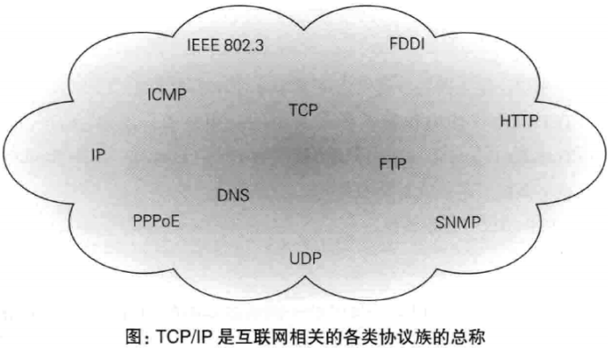
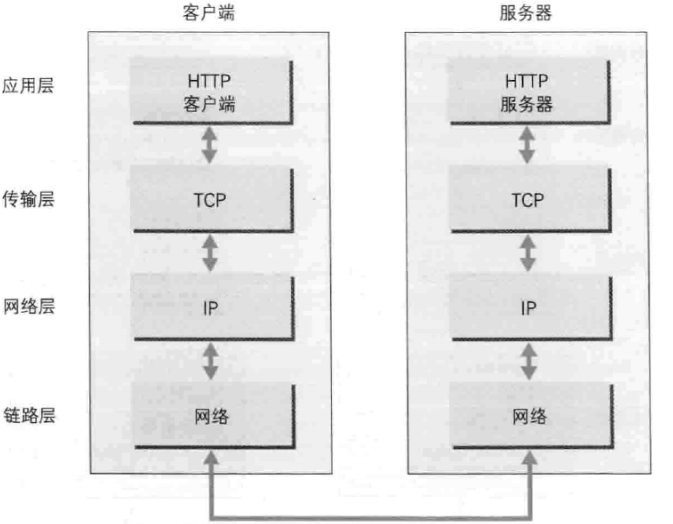
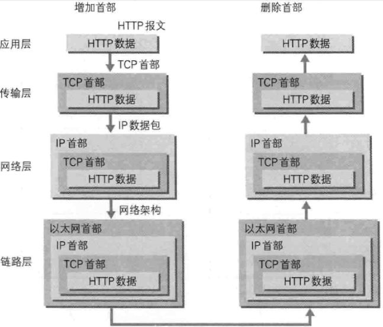

# 1.Web及网络基础 #
## 1.1 ##
  1.客户端：通过发送请求获取服务器资源的web浏览器。 
  2.web使用一种名为HTTP`超文本传输协议`的协议作为规范完成从客户端到服务器的等一系列运作流程，而协议指规则的约定，可以说web是建立在HTTP通信协议上的。 
  3.三项www（万维网）构建技术：
    <ul>
    <li>HTML超文本标记语言</li>
    <li>作为传输协议的HTTP</li>
    <li>指定文档所在地址的URL</li>
    </ul>
## 1.2网络基础TCP/IP ##
  1.通常使用的网络实在TCP/IP协议族的基础上运作的，而其属于HTTP内部的一个子集。
  协议指的是不同软件不同操作系统之间进行通讯的规则。
  
  2.TCP/IP是互联网相关各协议族的总称
 
 
  3.TCP/IP协议族 按层次分为以下四层：
    <ul>
    <li>应用层包含：FTP文件传输协议，DNS域名系统</li>
    <li>传输层：TCP传输控制协议，UDP用户数据报协议</li>
    <li>网络层：用来处理在网络上流动的数据包</li>
    <li>链路层：用来处理链接网络的硬件部分</li>
    </ul>
  4.利用TCP/IP进行协议族进行网络通信时会通过分层顺序与对方进行通信，发送端从应用层往下走，接收端从应用层往上走
  
  
  5.一次完整的HTTP请求过程：
<ol>
<li>客户端在应用层（HTTP协议）发出想看某个web页面的请求</li>
<li>为了传输方便在传输层（TCP协议）把从应用层收到的数据（HTTP请求报文）进行分割并在各个报文上打上标记序号和端口号后转发给网络层</li>
<li>在网络层（IP协议）增加作为通信目的地的的MAC地址后转发给链路层这样发往网络的通信请求就准备齐全了</li>
<li>接收端的服务器在链路层收到数据按序往上层传递一直到应用层，当传输到应用层才算真正接收到有客户端发出的HTTP请求。</li>
 
 
 
 
  6.发送端在层与层之间进行传输数据时，每经过一层就打上一个该层所属的首部信息，接收端在进行层与层之间的数据传输时，每经过一层就会去掉一个所属的首部信息。
 这种把数据包装起来的做法叫封装。
 
 
 
 
 
 
 
 
 
 
 
 
 
 
 
 
 
